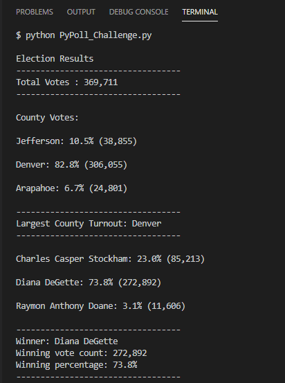
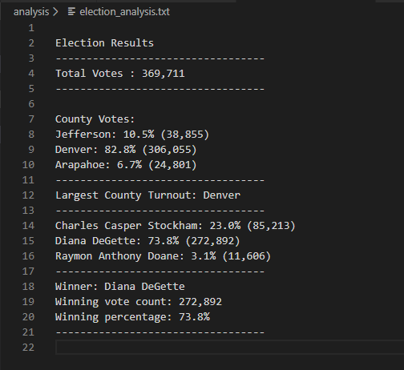

# Election Analysis

## Project Overview
A Colorado Board of Elections employee has given the following tasks to complete the election audit of a recent local congressional election.

- Calculate the total number of votes cast.
- Get  a complete list of candidates who received votes.
- Calculate the total number of votes each candidate received.
- Calculate the percentage of votes each candidate won.
- Determine the winner of the election based on popular vote.
- Get  a complete list of counties in which elections were held.
- Calculate the number of votes per county.
- Calculate the voter turnout in each county.
- Find out the county with largest turnout.
- Print the outcomes of the election analysis in the terminal.
- Save the outcomes of the election analysis in the text file.

## Resources
- Data Source : election_results.csv
- Tools :Python 3.7.6, Visual Studio Code, 1.41.1

## Summary of Results
The analysis of the elections show that:
- There were 369,711 votes cast in the election.
- The candidates were:
  - Charles Casper Stockham
  - Diana DeGette
  - Raymon Anthony Doane
 - The candidates results were:
  - Charles Casper Stockham received 23.0% of the vote and 85,213 number of votes.
  - Diana DeGette received 73.8%  of the vote and 272,892 number of votes.
  - Raymon Anthony Doane received 3.1% of the vote and 11,606 number of votes.
 - The winner of the election was:
  - Diana DeGette, who received 73.8% of the vote and 272,892 number of votes.
- There were three counties (named Jefferson, Denver and Arapahoe) in which elections were held.
- The number of votes per county are:
  - Jefferson:  38,855
  - Denver: 306,055
  - Arapahoe: 24,801
 - The voter turnout per county is:
  - Jefferson: 10.5% 
  - Denver: 82.8% 
  - Arapahoe: 6.7% 
 - The county with largest turnout is Denver.
 - The outcomes of the election analysis are able to print in the terminal.

	

 - Saved the outcomes of the election analysis in the text file.

	

